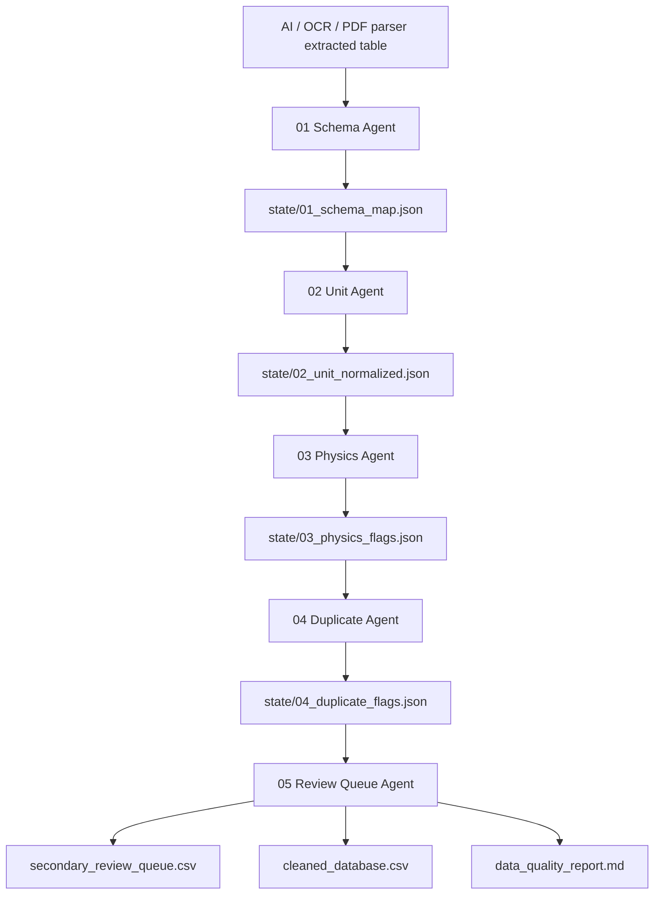
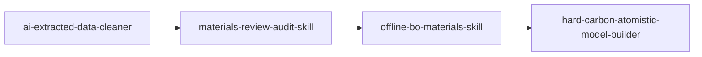

# ai-extracted-data-cleaner

<p align="center">
  <b>面向材料文献数据库构建的 AI 提取数据清洗 Skill</b><br>
  从 ChatGPT / MinerU / OCR / PDF Parser / 手工摘录得到的“脏数据”出发，完成字段标准化、单位统一、异常值识别、重复样本排查与二次原文核查队列生成。
</p>

<p align="center">
  
  
  
  
</p>

---

## 这个 Skill 解决什么问题？

材料科研中，AI 从论文 PDF、补充信息、图表或表格中提取的数据通常不能直接进入数据库或机器学习建模。常见问题包括：

- 字段名混乱：`BET`, `SSA`, `surface area`, `SBET` 指向同一类描述符。
- 单位混乱：`Å` 与 `nm`、`cm²/g` 与 `m²/g`、`mA/g` 与 `A/g` 混用。
- OCR 错误：`1230` 被识别成 `12300`，`0.37 nm` 被识别成 `3.7 nm`。
- 数据越界：`ICE > 100%`、负容量、负比表面积、过高孔容等。
- 重复样本：同一篇文章中的同一材料被不同表格重复记录。
- 条件混杂：同一材料在不同倍率、不同电解液、不同循环数下被误合并。
- 需要人工回查的样本没有被系统化列出。

本 Skill 的目标不是“自动相信 AI 提取结果”，而是建立一个**可追溯的数据清洗与二次核查工作流**。

---

## 定位

**English**

> A local multi-agent skill for cleaning, normalizing, and auditing AI-extracted literature datasets in chemical and materials engineering.

**中文**

> 面向化工与材料文献数据的 AI 提取结果清洗 Skill：用于字段标准化、单位统一、异常值识别、重复样本检查和二次原文核查队列生成。

---

## 适用场景

| 场景 | 说明 |
|---|---|
| PDF / OCR 数据提取后清洗 | 适用于 MinerU、OCR、LLM 表格抽取后的初始 Excel / CSV。 |
| 材料文献数据库构建 | 在进入正式数据库前，统一字段、单位和样本编号。 |
| 综述 source data 准备 | 为 `materials-review-audit-skill` 提供更干净的数据库和回查队列。 |
| AI4Materials 建模前质控 | 在机器学习、相关性分析、贝叶斯优化前排查异常样本。 |
| 人工二次核查排队 | 自动生成需要回查原文或 SI 的高风险样本清单。 |

---

## 核心功能

### 1. Field Normalization：字段标准化

将 AI 提取出的混乱字段统一为标准材料数据库字段：

| 标准字段 | 可能的原始写法 |
|---|---|
| `BET_m2_g` | BET, SSA, S_BET, surface area |
| `d002_nm` | d002, interlayer spacing, layer distance |
| `ID_IG` | ID/IG, I_D/I_G, Raman ratio |
| `XPS_N_at_pct` | N content, N at%, nitrogen content |
| `XPS_O_at_pct` | O content, O at%, oxygen content |
| `pore_volume_cm3_g` | total pore volume, V_total, pore volume |
| `mass_loading_mg_cm2` | loading, active mass loading, electrode loading |
| `ICE_pct` | initial coulombic efficiency, ICE, first CE |
| `capacity_mAh_g` | reversible capacity, specific capacity |
| `capacitance_F_g` | specific capacitance, gravimetric capacitance |

---

### 2. Unit Harmonization：单位统一

支持材料与电化学常见单位修正：

```text
Å -> nm
cm²/g -> m²/g
mA/g -> A/g
mg/cm² -> mg cm-2
wt% / at% 保留但标记类型
mAh/g, F/g, A/g, mV/s, °C 标准化
```

自动修正示例：

| 原始值 | 标准化后 | 说明 |
|---|---:|---|
| `3.72 Å` | `0.372 nm` | d002 Å 转 nm |
| `250000 cm2/g` | `25 m2/g` | cm²/g 转 m²/g |
| `100 mA/g` | `0.1 A/g` | 电流密度转换 |

---

### 3. Physics-Aware Outlier Detection：材料物理约束异常识别

不是简单用 z-score 判断异常，而是加入材料领域规则。

| 字段 | 高风险规则示例 |
|---|---|
| BET | `< 0` 或 `> 4000 m²/g` 标记为高风险 |
| d002 | `< 0.335 nm` 或 `> 0.50 nm` 标记为可疑 |
| ICE | `< 0` 或 `> 100%` 标记为 P0 |
| capacity | `< 0` 或过高值标记为 P0/P1 |
| capacitance | `< 0` 或异常高值标记为 P0/P1 |
| ID/IG | `< 0` 或 `> 3.5` 标记为需要核查 |
| mass loading | 缺失时标记为工程外推风险 |

---

### 4. Duplicate / Near-Duplicate Detection：重复样本排查

识别以下问题：

- 同一 `paper_id + sample_name` 重复出现。
- 样品名略有差异但关键性能完全一致。
- 同一材料不同倍率下被误当作独立材料样本。
- 旧版 Excel 和新版 Excel 合并时残留重复记录。

---

### 5. Secondary Review Queue：二次原文核查队列

输出 `secondary_review_queue.csv`，明确告诉你哪些样本必须回查论文或 SI。

| sample_id | field | risk_level | reason | required_action |
|---|---|---|---|---|
| SIB-032-4 | BET_m2_g | P1 | BET = 12300 m²/g, physically implausible | Check original figure/table/SI |
| LIB-011-2 | ICE_pct | P0 | ICE = 105%, exceeds 100% | Verify extraction or correct source value |
| SC-018-1 | mass_loading_mg_cm2 | P2 | Missing mass loading | Check electrode methods section |

---

### 6. Correction Log：可追溯修改日志

任何自动修正都会写入：

```text
correction_log.csv
```

包含：

```text
sample_id
field
original_value
cleaned_value
correction_type
confidence
reason
```

---

## 多 Agent 工作流

本 Skill 支持“脚本基线 + 多 Agent 审计协议”。脚本负责可重复的数据规则，Agent 负责解释、仲裁和生成二次核查建议。



---

## 输入文件

推荐输入为 `.xlsx` 或 `.csv`：

```text
data/extracted/my_ai_extracted_data.xlsx
```

至少建议包含这些列中的一部分：

```text
paper_id
sample_id
sample_name
precursor
material_type
carbonization_temperature_C
BET
d002
ID/IG
XPS_N
XPS_O
pore_volume
mass_loading
ICE
capacity
capacitance
current_density
electrolyte
source_location
```

不要求完全一致，Skill 会尝试自动映射字段。

---

## 输出文件

| 输出文件 | 作用 |
|---|---|
| `cleaned_database.csv` | 字段和单位标准化后的主数据表。 |
| `flagged_records.csv` | 所有异常记录和风险标记。 |
| `secondary_review_queue.csv` | 需要回查原文 / SI 的样本队列。 |
| `paper_level_audit.csv` | 按论文聚合的风险统计。 |
| `correction_log.csv` | 自动修正和单位转换记录。 |
| `data_quality_report.md` | 中文数据质量报告，可直接放入审计记录。 |
| `state/*.json` | 多 Agent 传递用中间态，减少 token 消耗。 |

---

## 安装

```bash
pip install -r requirements.txt
pip install -e .
```

---

## 快速使用

### 方式一：命令行

```bash
python -m ai_extracted_data_cleaner.cli clean \
  --input examples/input/raw_ai_extracted_samples.csv \
  --outdir outputs/demo
```

### 方式二：脚本

```bash
python scripts/clean_ai_extracted_data.py \
  --input examples/input/raw_ai_extracted_samples.csv \
  --outdir outputs/demo
```

---

## 在 Codex / OpenClaw 中使用

将本文件夹复制到你的本地 skills 目录：

```text
skills/ai-extracted-data-cleaner/
```

然后在 Codex / OpenClaw 中使用类似提示：

```text
Use the ai-extracted-data-cleaner skill. Clean data/extracted/my_ai_extracted_data.xlsx.
Focus on materials literature descriptors, unit harmonization, physically implausible values, duplicate samples, and samples requiring second-round source verification.
Use JSON state files to pass intermediate results between agents.
```

---

## 推荐与其他 Skill 串联



建议定位：

| Skill | 角色 |
|---|---|
| `ai-extracted-data-cleaner` | 上游数据清洗和二次核查排队。 |
| `materials-review-audit-skill` | 综述正文、图表、source_data、Excel 数据库一致性审计。 |
| `offline-bo-materials-skill` | 基于清洗后数据库做离线贝叶斯优化模拟。 |
| `hard-carbon-atomistic-model-builder` | 构建 DFT / MLFF / ASE 输入结构。 |

---

## 项目结构

```text
ai-extracted-data-cleaner/
├── README.md
├── skill.md
├── AGENTS.md
├── requirements.txt
├── pyproject.toml
├── config/
│   ├── field_aliases.yaml
│   └── validation_rules.yaml
├── schemas/
│   ├── cleaned_record.schema.json
│   ├── flag_record.schema.json
│   └── agent_state.schema.json
├── prompts/
│   ├── 01_schema_agent.md
│   ├── 02_unit_agent.md
│   ├── 03_physics_agent.md
│   ├── 04_duplicate_agent.md
│   └── 05_review_queue_agent.md
├── scripts/
│   └── clean_ai_extracted_data.py
├── src/ai_extracted_data_cleaner/
│   ├── cli.py
│   ├── cleaner.py
│   ├── fields.py
│   ├── units.py
│   ├── validators.py
│   ├── duplicates.py
│   ├── report.py
│   └── utils.py
├── examples/
│   └── input/raw_ai_extracted_samples.csv
└── tests/
```

---

## 风险等级

| 等级 | 含义 | 处理建议 |
|---|---|---|
| P0 | 必须修正 | 数据越界、单位明显错误、关键性能不可能。 |
| P1 | 强烈建议核查 | 物理上可疑、可能 OCR 错误、与同文献其他样本不一致。 |
| P2 | 可选优化 | 缺失工程参数、字段不完整、建议补充来源位置。 |

---

## 当前限制

- 本 Skill 不会替代人工阅读原文。
- 对图像型 PDF 表格的识别依赖上游 OCR / Parser。
- 对材料体系的判断依赖字段和上下文，不能保证所有边界情况完全正确。
- 对单位的自动修正会记录到 `correction_log.csv`，高风险修正仍建议回查原文。

---

## 适合放在 GitHub 首页的一句话

> 这个项目不是普通 Excel 清洗脚本，而是一个面向材料文献数据库构建的 AI 提取数据质量控制工作流：它把字段标准化、单位统一、物理异常识别、重复样本检测和二次原文核查队列合并到一个可复现的多 Agent + JSON 流程中。
