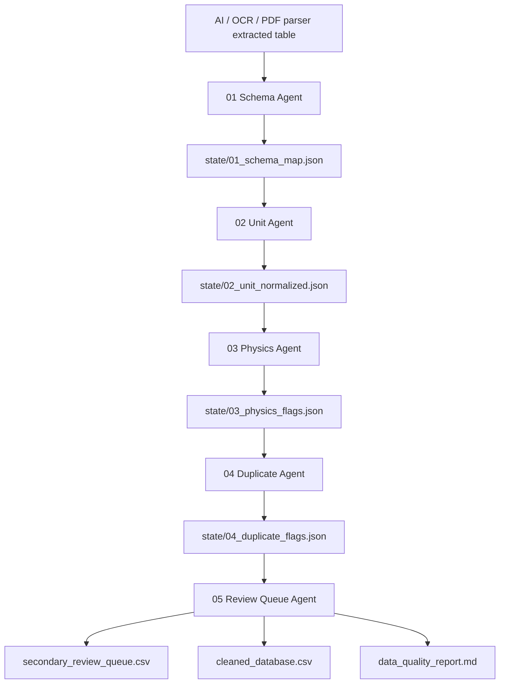
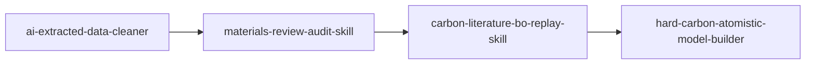

# ai-extracted-data-cleaner

<p align="center">
  <b>面向材料文献数据库构建的 AI 提取数据清洗 Skill</b><br>
  从 ChatGPT / MinerU / OCR / PDF Parser / 手工摘录得到的“脏数据”出发，完成字段标准化、单位统一、异常值识别、重复样本排查与二次原文核查队列生成。
</p>

<p align="center">
  
  
  
  
</p>

---

## 这个 Skill 解决什么问题？

材料科研中，AI 从论文 PDF、补充信息、图表或表格中提取的数据通常不能直接进入数据库或机器学习建模。常见问题包括：

- 字段名混乱：`BET`, `SSA`, `surface area`, `SBET` 指向同一类描述符。
- 单位混乱：`Å` 与 `nm`、`cm²/g` 与 `m²/g`、`mA/g` 与 `A/g` 混用。
- OCR 错误：`1230` 被识别成 `12300`，`0.37 nm` 被识别成 `3.7 nm`。
- 数据越界：`ICE > 100%`、负容量、负比表面积、过高孔容等。
- 重复样本：同一篇文章中的同一材料被不同表格重复记录。
- 条件混杂：同一材料在不同倍率、不同电解液、不同循环数下被误合并。
- 需要人工回查的样本没有被系统化列出。

本项目的目标不是“自动相信 AI 提取结果”，而是建立一个**可追溯的数据清洗与二次核查工作流**。所有自动单位修正都会进入 `correction_log.csv`，所有高风险样本都会进入 `secondary_review_queue.csv`。

---

## 版本定位：v1.1.0

相比初版，v1.1.0 主要强化了 GitHub 可发布性和正式安装后的稳定性：

- 清理仓库产物：不再把 `.git/`、`outputs/`、`__pycache__/`、`.pytest_cache/` 打进发布包。
- 新增 `.gitignore`。
- 默认 YAML 配置打包进 Python package，避免 `pip install` 后找不到 `config/*.yaml`。
- CLI 支持自定义 `--aliases` 和 `--rules`。
- 修正单位识别：`mAh/g` 不会被误判成 `Ah/g`。
- 增加 `cleaning_manifest.json`，记录版本、输入、输出、flag 数、correction 数和最终决策。
- 空 `flagged_records.csv` 也保留表头，便于后续脚本读取。
- 增加字段映射冲突审计和更稳定的 duplicate 检测。
- 测试扩展到 8 个用例。

---

## 核心功能

### 1. Field normalization：字段标准化

将 AI 提取出的混乱字段统一为标准材料数据库字段：

| 标准字段 | 常见原始写法 |
|---|---|
| `BET_m2_g` | BET, SSA, S_BET, surface area, BET area |
| `d002_nm` | d002, interlayer spacing, layer distance |
| `ID_IG` | ID/IG, I_D/I_G, Raman ratio |
| `XPS_N_at_pct` | N content, N at%, nitrogen content |
| `XPS_O_at_pct` | O content, O at%, oxygen content |
| `pore_volume_cm3_g` | total pore volume, V_total, pore volume |
| `mass_loading_mg_cm2` | loading, active mass loading, electrode loading |
| `ICE_pct` | initial coulombic efficiency, ICE, first CE |
| `capacity_mAh_g` | reversible capacity, specific capacity |
| `capacitance_F_g` | specific capacitance, gravimetric capacitance |

字段映射结果写入：

```text
state/01_schema_map.json
```

如果多个原始字段映射到同一个标准字段，会在 schema state 和质量报告中标出，避免重复列被悄悄吞掉。

---

### 2. Unit harmonization：单位统一

当前支持的典型转换：

| 原始值 | 标准化后 | 说明 |
|---|---:|---|
| `3.72 Å` | `0.372 nm` | d002 Å 转 nm |
| `250000 cm2/g` | `25 m2/g` | cm²/g 转 m²/g |
| `100 mA/g` | `0.1 A/g` | 电流密度 mA/g 转 A/g |
| `0.31 Ah/g` | `310 mAh/g` | Ah/g 转 mAh/g |
| `1073 K` | `799.85 °C` | K 转 °C |
| `10 g/m2` | `1 mg/cm2` | 面载量 g/m² 转 mg/cm² |

所有自动修正都会写入：

```text
correction_log.csv
```

---

### 3. Physics-aware validation：物理约束异常识别

不是简单做 z-score，而是结合材料领域规则判断异常：

| 字段 | 风险规则示例 |
|---|---|
| `BET_m2_g` | `<0` 或 `>10000` 为 P0；`>4000` 为 P1 |
| `d002_nm` | `<0.30` 或 `>1.0` 为 P0；典型范围外为 P1 |
| `ICE_pct` | `<0` 或 `>100` 为 P0 |
| `capacity_mAh_g` | `<0` 或 `>5000` 为 P0；`>2000` 为 P1 |
| `capacitance_F_g` | `<0` 或 `>3000` 为 P0；`>1000` 为 P1 |
| `ID_IG` | `<0` 为 P0；`>3.5` 为 P1 |
| 工程参数 | mass loading / thickness / density 缺失时标记为 P2 |

规则可通过 `config/validation_rules.yaml` 修改。

---

### 4. Duplicate / near-duplicate detection：重复样本排查

识别以下问题：

- `sample_id` 重复。
- 同一 `paper_id + sample_name` 重复。
- 关键描述符、测试条件和性能值完全重复。
- 旧版 Excel 与新版 Excel 合并时残留重复记录。

重复样本不会被自动删除，而是进入二次核查队列。

---

### 5. Secondary review queue：二次原文核查队列

输出：

```text
secondary_review_queue.csv
```

示例字段：

| sample_id | field | risk_level | reason | required_action |
|---|---|---|---|---|
| SIB-032-4 | BET_m2_g | P1 | BET above typical range | Check original figure/table/SI |
| LIB-011-2 | ICE_pct | P0 | ICE exceeds 100% | Verify extraction or correct source value |
| SC-018-1 | mass_loading_mg_cm2 | P2 | Missing mass loading | Check electrode methods section |

---

## 输入文件

支持 `.csv`、`.txt`、`.xlsx`、`.xls`。

建议至少包含这些列中的一部分：

```text
paper_id
sample_id
sample_name
precursor
material_type
carbonization_temperature_C
BET
d002
ID/IG
XPS_N
XPS_O
pore_volume
mass_loading
ICE
capacity
capacitance
current_density
electrolyte
source_location
```

列名不要求完全一致，工具会根据 `field_aliases.yaml` 自动映射。

---

## 输出文件

| 输出文件 | 作用 |
|---|---|
| `cleaned_database.csv` | 字段和单位标准化后的主数据表。 |
| `flagged_records.csv` | 所有异常记录和风险标记。 |
| `secondary_review_queue.csv` | 需要回查原文 / SI 的样本队列。 |
| `paper_level_audit.csv` | 按论文聚合的风险统计。 |
| `correction_log.csv` | 自动修正和单位转换记录。 |
| `data_quality_report.md` | 中文数据质量报告，可直接放入审计记录。 |
| `cleaning_manifest.json` | 本次清洗运行摘要、版本、决策和输出清单。 |
| `state/*.json` | 多 Agent 传递用中间态，减少 token 消耗。 |

---

## 安装

```bash
pip install -r requirements.txt
pip install -e .
```

开发测试：

```bash
pytest -q
```

---

## 快速使用

### 方式一：命令行

```bash
python -m ai_extracted_data_cleaner.cli clean \
  --input examples/input/raw_ai_extracted_samples.csv \
  --outdir outputs/demo
```

也可以使用安装后的 console script：

```bash
ai-extracted-data-cleaner clean \
  --input examples/input/raw_ai_extracted_samples.csv \
  --outdir outputs/demo
```

使用自定义字段别名和验证规则：

```bash
ai-extracted-data-cleaner clean \
  --input data/my_ai_extracted_data.xlsx \
  --outdir outputs/my_cleaned_data \
  --aliases config/field_aliases.yaml \
  --rules config/validation_rules.yaml
```

### 方式二：脚本

```bash
python scripts/clean_ai_extracted_data.py \
  --input examples/input/raw_ai_extracted_samples.csv \
  --outdir outputs/demo
```

---

## 在 Codex / OpenClaw 中使用

将本文件夹复制到你的本地 skills 目录：

```text
skills/ai-extracted-data-cleaner/
```

然后使用类似提示：

```text
Use the ai-extracted-data-cleaner skill. Clean data/extracted/my_ai_extracted_data.xlsx.
Focus on materials literature descriptors, unit harmonization, physically implausible values, duplicate samples, and samples requiring second-round source verification.
Use JSON state files to pass intermediate results between agents.
Do not silently delete rows; generate a secondary review queue.
```

---

## 多 Agent 工作流

脚本负责可重复的数据规则，Agent 负责解释、仲裁和生成二次核查建议。



---

## 风险等级

| 等级 | 含义 | 处理建议 |
|---|---|---|
| P0 | 必须修正 | 数据越界、单位明显错误、关键性能不可能。 |
| P1 | 强烈建议核查 | 物理上可疑、可能 OCR 错误、与同文献其他样本不一致。 |
| P2 | 可选优化 | 缺失工程参数、字段不完整、建议补充来源位置。 |

---

## 推荐与其他 Skill 串联



建议定位：

| Skill | 角色 |
|---|---|
| `ai-extracted-data-cleaner` | 上游数据清洗和二次核查排队。 |
| `materials-review-audit-skill` | 综述正文、图表、source_data、Excel 数据库一致性审计。 |
| `carbon-literature-bo-replay-skill` | 基于清洗后数据库做离线贝叶斯优化 replay。 |
| `hard-carbon-atomistic-model-builder` | 构建 DFT / MLFF / ASE 输入结构。 |

---

## 当前限制

- 本 Skill 不替代人工阅读原文。
- 对图像型 PDF 表格的识别依赖上游 OCR / Parser。
- 对材料体系的判断依赖字段和上下文，不能保证所有边界情况完全正确。
- 自动单位修正虽然会记录到 `correction_log.csv`，但高影响、低置信修正仍建议回查原文。
- 对“同一材料不同测试条件”的判断需要结合倍率、循环数、电解液和电压窗口，不能只看样品名。

---

## 适合放在 GitHub 首页的一句话

> 这个项目不是普通 Excel 清洗脚本，而是一个面向材料文献数据库构建的 AI 提取数据质量控制工作流：它把字段标准化、单位统一、物理异常识别、重复样本检测和二次原文核查队列合并到一个可复现的多 Agent + JSON 流程中。
